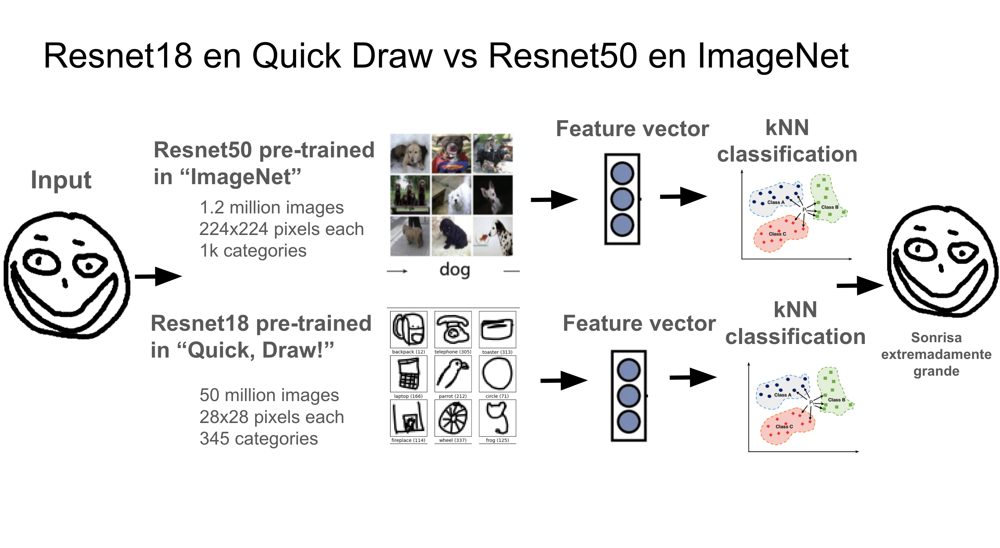

# Austism Sketch Classifier

## Overview

AutismSketchClassifier is a computer vision project that utilizes a ResNet18 neural network to classify sketches drawn by children with autism. The unique characteristics of these drawings, such as the omission of specific facial features like pupils, serve as critical indicators for classification. This repository includes the implementation of the neural network training, the application of a KNN classifier, and the datasets used for training and evaluation.

  

<b>Figure 1.</b> Methodology   

## Project Structure

- `data/`: Contains the datasets of sketches, consisting of artificial samples of austism sketches to test the model.
- `models/`: Includes the pre-trained ResNet18 model and the final trained models.
- `notebooks/`: Jupyter notebooks for data exploration, model training, and evaluation.
- `README.md`: Project overview and instructions.

## Datasets

- QuickDraw Dataset: A large collection of 55 million sketches used for pre-training the ResNet18 model.
- Artificial Autism Sketches: Generated samples to mimic the drawing style of children with autism.

## Acknowledgements

Thanks to the creators of the QuickDraw Dataset for providing a valuable resource for pre-training.

Special appreciation to the contributors who helped in collecting and annotating the autism sketch dataset.

